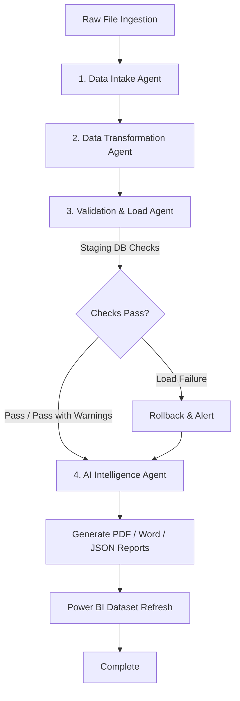

# Intelligent Autonomous Agentic AI ETL Platform
**SnapLogic (Commercial Intelligent Integration Platform - SnapLogic IIP) + Multi-Agent AI (LangGraph & Gemini) + FastAPI + Modern Frontend + MySQL + Power BI**

A production-ready, autonomous data engineering platform that ingests raw datasets, automatically profiles schemas, cleanses and standardizes records, validates constraints, loads data into MySQL database staging/production environments, and generates AI-driven Root Cause Analysis (RCA) executive reports.

---

## 🛠️ Complete Technology Stack

### 🎨 Frontend Stack (User Interface & Dashboards)
- **HTML5**: Semantic single-page layout with interactive dashboard panels, file upload drag-and-drop zone, live timeline tracking, and data tables.
- **Vanilla CSS3**: Custom Glassmorphism design system with dark/light themes, smooth transitions, responsive flex/grid layouts, and custom scrollbars.
- **JavaScript (ES6+)**: SPA state management, REST API integration, asynchronous polling, drag-and-drop handlers, dynamic pagination, and toast notification system.
- **Chart.js**: Dynamic interactive data visualization for Quality Score gauges, summary bar graphs, and error breakdown charts.
- **Font Awesome 6.4.0**: Modern UI icon suite for action buttons, navigation tabs, status indicators, and file formats.
- **Google Fonts (Outfit)**: Modern typography and font hierarchy.

### ⚙️ Backend Stack (Core Engine & APIs)
- **Python 3.10+**: Core programming language for processing pipeline and agent graph execution.
- **FastAPI**: Asynchronous, high-performance web framework for high-throughput REST APIs.
- **Uvicorn**: Lightning-fast ASGI server implementation for async Python applications.
- **Pydantic & Pydantic-Settings**: Strict runtime type validation, request/response schema serialization, and `.env` settings management.
- **Pandas & NumPy**: High-performance data manipulation, CSV/Excel parsing (`openpyxl`), automated cleansing, median imputation, and type inference.
- **SQLAlchemy 2.0 & PyMySQL**: Object Relational Mapper (ORM) and MySQL driver for database schemas, transactions, and staging loads.
- **SQLite Engine**: Embedded fallback database (`agentic_ai_etl.db`) for offline development and local simulation.
- **Redis (`redis-py`)**: In-memory caching, job state storage, and rate-limiting key-value store.
- **HTTPX**: Asynchronous HTTP client for background microservice communication.
- **ReportLab**: PDF document generation engine for executive analytical reports.
- **python-docx**: Microsoft Word (`.docx`) document exporter for executive summaries and audit reports.
- **Cryptography & Python-Multipart**: Secure token encryption, password hashing, and form-data file upload parsing.

### 🤖 Artificial Intelligence & Agentic Workflow
- **LangGraph**: Framework for constructing stateful multi-agent workflows with decision nodes, fallback branches, and state persistence.
- **LangChain & LangChain Community**: LLM orchestration, prompt engineering, tool bindings, and chain pipelines.
- **Google Gemini API (`langchain-google-genai`)**: Primary AI LLM model (`gemini-2.5-flash`) for schema profiling, cleansing strategy generation, RCA reports, and AI chat assistant.
- **Ollama**: Local containerized LLM runner (`http://ollama:11434`) for offline or air-gapped deployments.
- **Programmatic Heuristic LLM Engine**: Built-in offline fallback engine providing deterministic dataset cleansing and profiling rules.

### 🐳 Infrastructure & Data Orchestration
- **SnapLogic (Commercial Intelligent Integration Platform - SnapLogic IIP)**: Industrial visual dataflow orchestrator, file intake monitoring (`FileReader`), Iris AI recommendations, and REST HTTP triggers (`RESTPost`).
- **Docker & Docker Compose**: Multi-container containerization orchestrating `etl_backend`, `etl_mysql`, `etl_redis`, `etl_snaplogic`, and `etl_ollama`.
- **MySQL 8.0**: Production relational database (`agentic_ai_etl` & `agentic_ai_etl_staging`).
- **Power BI / Analytics**: Real-time KPI reporting, dataset modeling specifications, and automated refresh sync.

---

## 🌐 Complete API Specification (`/api/v1`)

The backend exposes a RESTful API organized into specialized domain routers:

| Router | Endpoint | Method | Description |
| :--- | :--- | :---: | :--- |
| **Authentication** | `/api/v1/auth/login` | `POST` | Authenticate user and issue session token |
| | `/api/v1/auth/me` | `GET` | Retrieve current authenticated user profile |
| **Data Ingestion** | `/api/v1/upload` | `POST` | Accept CSV/XLSX file uploads for processing |
| **Pipeline Engine** | `/api/v1/pipeline/execute` | `POST` | Trigger full LangGraph multi-agent ETL workflow |
| | `/api/v1/pipeline/status/{batch_id}` | `GET` | Query batch execution status and progress logs |
| **SnapLogic Integration**| `/api/v1/pipeline/start` | `POST` | SnapLogic workflow initialization endpoint |
| | `/api/v1/pipeline/intake` | `POST` | SnapLogic Agent 1: Data collection & schema profiling |
| | `/api/v1/pipeline/transform` | `POST` | SnapLogic Agent 2: Data cleaning & transformation |
| | `/api/v1/pipeline/store` | `POST` | SnapLogic Agent 3: Database loading & constraint check |
| | `/api/v1/pipeline/report` | `POST` | SnapLogic Agent 4: PDF & DOCX executive report generation |
| **Dashboard Analytics**| `/api/v1/dashboard/metrics` | `GET` | System summary KPIs, quality scores, & row counts |
| | `/api/v1/dashboard/batches` | `GET` | List all processed data batch records |
| | `/api/v1/dashboard/dataset/{batch_id}` | `GET` | Fetch raw vs clean records for interactive table viewer |
| **Reports Exporter** | `/api/v1/reports/list` | `GET` | List all generated PDF/Word/Markdown/JSON reports |
| | `/api/v1/reports/download/{filename}` | `GET` | Download executive report files |
| | `/api/v1/reports/summary/{batch_id}` | `GET` | Get structured JSON report summary |
| **AI Assistant Chat** | `/api/v1/chat` | `POST` | Interactive natural language dataset queries with Gemini |
| **Power BI Integration**| `/api/v1/powerbi/datasets` | `GET` | Export structured data models for Power BI |
| | `/api/v1/powerbi/refresh` | `POST` | Trigger automated Power BI dashboard dataset refresh |
| **System Diagnostics**| `/api/v1/health` | `GET` | System health check (Database, Redis, LLM connections) |

---

## 📂 Project Architecture & Directory Layout

```text
ETL-A/
├── frontend/             # Single-Page Application (HTML5, Vanilla CSS3, JS, Chart.js)
│   ├── index.html        # Main Dashboard, Upload, Data Table, Chat & Reports UI
│   ├── style.css         # Custom Glassmorphic design system & themes
│   └── app.js            # Frontend state, API integration, and Chart rendering
├── backend/              # FastAPI Application & Business Logic
│   ├── main.py           # FastAPI application entry point & router registrations
│   ├── api/              # Domain routers (auth, upload, pipeline, reports, dashboard, chat, powerbi)
│   ├── core/             # Configuration settings, LLM client initialization (Gemini/Ollama)
│   ├── database/         # SQLAlchemy MySQL & SQLite models, repositories, and connections
│   ├── schemas/          # Pydantic data structures & API schemas
│   └── utils/            # Data cleansing, file handlers, PDF/Word generation utilities
├── agents/               # 4 Specialized AI Agents (Intake, Transformation, Validation, Intelligence)
├── agents_graph/         # LangGraph state machine, execution graph nodes, and edges
├── snaplogic/            # SnapLogic IIP visual pipeline definitions (`snaplogic_pipeline.json`, `snaplogic_flow.json`)
├── docker/               # Containerization (`docker-compose.yml`, `Dockerfile.backend`, `init.sql`)
├── data/                 # Local data storage (`raw/`, `processed/`, `rejected/`, `archive/`)
├── reports/              # Output analytical reports (`pdf/`, `docx/`, `markdown/`, `json/`)
├── powerbi/              # Power BI data modeling specifications & layouts
├── requirements.txt      # Python dependencies manifest
├── generate_sample_data.py # Mock raw dataset generator script
└── verify_pipeline.py    # Offline end-to-end integration test runner
```

---

## 💻 Quick Start & Running

### 1. Install Dependencies
```bash
pip install -r requirements.txt
```

### 2. Local Simulation & Verification Test
Run offline verification (uses local SQLite and mock heuristics):
```bash
# Generate sample datasets
python generate_sample_data.py

# Execute test suite
python verify_pipeline.py
```

### 3. Launch Stack via Docker Compose
Launch MySQL, Redis, SnapLogic IIP, Ollama, and FastAPI Backend:
```bash
cd docker
docker-compose up --build
```

Access Services:
- **Web Frontend Dashboard**: `http://localhost:8000/`
- **FastAPI OpenAPI Interactive Specs**: `http://localhost:8000/docs`
- **SnapLogic IIP Web Console**: `http://localhost:8080/snaplogic`
- **MySQL Database**: `localhost:3306`

---

## 🤖 Multi-Agent Workflow Architecture


