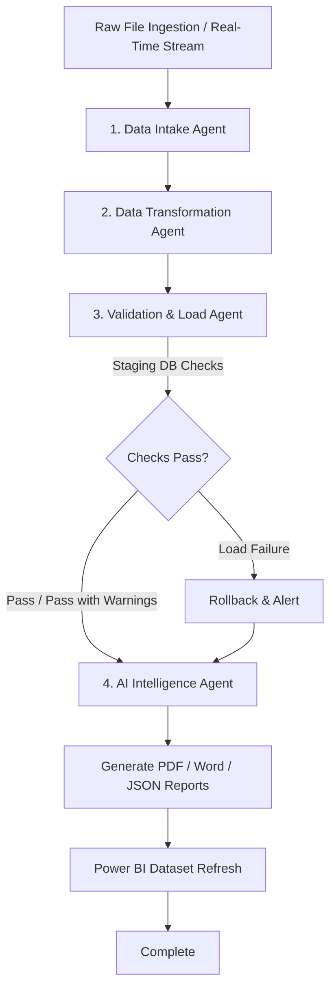

# Intelligent Autonomous Agentic AI ETL Platform
**SnapLogic (Commercial Intelligent Integration Platform - SnapLogic IIP) + Multi-Agent AI (LangGraph & Gemini) + FastAPI + Modern Frontend + MySQL + Power BI**

A production-ready, autonomous data engineering platform that ingests raw datasets, automatically profiles schemas, cleanses and standardizes records, validates constraints, loads data into MySQL database staging/production environments, and generates AI-driven Root Cause Analysis (RCA) executive reports.

---

## 🛠️ Complete Technology Stack

### 🎨 Frontend Stack (User Interface & Dashboards)
- **HTML5**: Semantic single-page layout with interactive dashboard panels, file upload drag-and-drop zone, live timeline tracking, and data tables.
- **Vanilla CSS3**: Custom Glassmorphism design system with dark/light themes, smooth transitions, responsive flex/grid layouts, and custom scrollbars.
- **JavaScript (ES6+)**: SPA state management, REST API integration, asynchronous polling, drag-and-drop handlers, dynamic pagination, and toast notification system.
- **Chart.js**: Execution-duration trend chart on the dashboard.
- **Font Awesome 6.4.0**: Modern UI icon suite for action buttons, navigation tabs, status indicators, and file formats.
- **Google Fonts (Plus Jakarta Sans, JetBrains Mono)**: Typography.

### ⚙️ Backend Stack (Core Engine & APIs)
- **Python 3.10+**: Core programming language for processing pipeline and agent graph execution.
- **FastAPI**: Asynchronous, high-performance web framework for high-throughput REST APIs.
- **Uvicorn**: Lightning-fast ASGI server implementation for async Python applications.
- **Pydantic & python-dotenv**: Request/response validation and `.env` configuration.
- **Pandas & NumPy**: High-performance data manipulation, CSV/Excel parsing (`openpyxl`), automated cleansing, median imputation, and type inference.
- **SQLAlchemy 2.0 & PyMySQL**: Object Relational Mapper (ORM) and MySQL driver for database schemas, transactions, and staging loads.
- **SQLite Engine**: Embedded fallback database (`agentic_ai_etl.db`) for offline development and local simulation.
- **HTTPX**: HTTP client for URL ingestion, live feeds and the Gemini model list.
- **ReportLab**: PDF document generation engine for executive analytical reports.
- **python-docx**: Microsoft Word (`.docx`) document exporter for executive summaries and audit reports.
- **Python-Multipart**: File upload parsing. Passwords use salted PBKDF2 and sessions use HMAC-signed tokens (Python standard library).

### 🤖 Artificial Intelligence & Agentic Workflow
- **LangGraph**: Framework for constructing stateful multi-agent workflows with decision nodes, fallback branches, and state persistence.
- **Google Gemini API (`langchain-google-genai`)**: Chat assistant, profiling recommendations and report summaries. Available models are discovered from the API at startup (newest flash models first, `GEMINI_MODEL` to pin one).
- **Ollama (optional)**: Local LLM fallback (`docker compose --profile ollama up`, then pull `llama3`).
- **Offline fallback**: Without an LLM, profiling, cleaning, RCA and reports are still computed from the data; the chat still serves files and logs.

### 🐳 Infrastructure & Data Orchestration
- **SnapLogic (optional)**: `snaplogic/snaplogic_pipeline.json` watches `data/raw` and triggers `/api/v1/pipeline/start` with `X-API-Key: $SERVICE_API_KEY`.
- **Docker & Docker Compose**: `etl_backend` and `etl_mysql` (plus optional `etl_ollama`).
- **MySQL 8.0**: Production database `agentic_ai_etl` (staging tables are prefixed `staging_`); SQLite fallback when MySQL is unreachable.
- **Power BI**: Star-schema CSV exports per user (FactSales, FactOrders, DimCustomer, FactExecution, FactDataQuality, DimAgent) for Power BI Desktop.

---

## 🌐 Complete API Specification (`/api/v1`)

The backend exposes a RESTful API organized into specialized domain routers. Interactive docs are served at `/docs`.

### 🔐 Authentication
Every endpoint except `/api/v1/auth/*` and `/api/v1/health` requires a session token:

1. `POST /api/v1/auth/login` with `{"username": "<email>", "password": "..."}` returns `{"token": "..."}`.
2. Send it as `Authorization: Bearer <token>` (or as `?token=<token>` on plain download links).

The account is always derived from the token; a client-supplied `X-User-Email` header is ignored. Each account only sees its own uploads, pipeline runs, cleaned files and reports (the `admin@controlai.net` administrator can open any batch). Passwords are stored as salted PBKDF2 hashes. Automation such as SnapLogic can call the API with `X-API-Key: $SERVICE_API_KEY` plus `X-User-Email`.

On a fresh database the administrator `admin@controlai.net` is created with the password from `DEFAULT_ADMIN_PASSWORD` (default `admin`, **change it outside local development**).

| Router | Endpoint | Method | Description |
| :--- | :--- | :---: | :--- |
| **Authentication** | `/api/v1/auth/signup` | `POST` | Create an account |
| | `/api/v1/auth/login` | `POST` | Authenticate and issue a session token |
| | `/api/v1/auth/me` | `GET` | Current authenticated user |
| | `/api/v1/auth/forgot-password` · `/verify-reset-code` · `/reset-password` | `POST` | Password reset (15 min codes, 5 attempts) |
| | `/api/v1/auth/profile` · `/change-password` | `GET`/`PUT`/`POST` | Profile (display name, date of birth) and password change |
| | `/api/v1/auth/api-keys` | `GET`/`POST`/`DELETE` | Personal API keys, sent as `X-API-Key` (only a hash is stored) |
| **Data Ingestion** | `/api/v1/upload` | `POST` | Upload a dataset file (CSV, TSV, XLSX, JSON, XML, ...) |
| | `/api/v1/upload/url` | `POST` | Ingest a dataset from a public URL |
| | `/api/v1/upload/realtime` | `POST` | Generate and register a synthetic streaming batch |
| **Pipeline Engine** | `/api/v1/pipeline/start` | `POST` | Run the full LangGraph multi-agent ETL workflow for an uploaded batch |
| | `/api/v1/pipeline/status?pipeline_id=pipe_<batch_id>` | `GET` | Stage-by-stage status, previews and logs |
| | `/api/v1/pipeline/flowchart?batch_id=` · `/graph-json?batch_id=` | `GET` | Pipeline flowchart (SVG) / graph JSON |
| **SnapLogic Agents** | `/api/v1/pipeline/intake` · `/transform` · `/store` · `/report` | `POST` | Run a single agent (called by SnapLogic IIP) |
| **Quality & Logs** | `/api/v1/data-quality` · `/api/v1/root-cause` · `/api/v1/logs` | `GET` | Quality scores, RCA findings and agent logs (optional `batch_id`) |
| **Run History** | `/api/v1/history` · `/api/v1/history/{batch_id}/log` | `GET` | Every upload with its run results / the full process log of a run |
| **Dashboard Analytics**| `/api/v1/dashboard/summary` | `GET` | KPIs: rows processed, success rate, quality, recent runs |
| | `/api/v1/dashboard/metrics` | `GET` | Run telemetry: totals, availability, latency |
| | `/api/v1/dashboard/datasets` · `/download?file_path=` | `GET` | List / download cleaned datasets and reports |
| **Reports Exporter** | `/api/v1/reports/folders` · `/history` | `GET` | Reports grouped per dataset / report history |
| | `/api/v1/reports/download/{batch_id}?format=pdf\|docx\|markdown\|json` | `GET` | Download a batch report |
| | `/api/v1/reports/latest?format=` · `/download-file?path=` | `GET` | Latest report / any file in your workspace |
| **AI Assistant Chat** | `/api/v1/agent/chat` | `POST` | Natural-language questions about runs, RCA, schema, SQL |
| **RAG Knowledge Base** | `/api/v1/rag/upload` · `/upload/url` · `/documents` · `/search` | `POST`/`GET`/`DELETE` | Index documents and search them |
| **Power BI Integration**| `/api/v1/powerbi/status` · `/schema` · `/measures` | `GET` | Connector status, per-table row counts, star schema and DAX measures |
| | `/api/v1/powerbi/refresh` | `POST` | Export the star schema (FactSales, FactOrders, DimCustomer, ...) as CSV files for Power BI Desktop |
| **System Diagnostics**| `/api/v1/health` | `GET` | Health check (database connectivity) |

### ✅ Validation Rules Applied During Load
- Rows missing a primary key, duplicating a primary key within the batch, missing `customer_name` (customers), or holding non-numeric quantities/prices or unparseable dates are **rejected individually** with a reason; the rest of the batch still loads. Rejections feed the Root Cause Analysis reports.
- A run is `Success` when every row loads, `Passed with Warnings` when some rows are rejected, and `Failed` when nothing could be loaded (including empty files).
- Files that reference an identifier of their own (e.g. `transaction_id`) are stored as generic datasets instead of overwriting the customer master table.

---

## 📂 Project Architecture & Directory Layout

```text
ETL-A/
├── frontend/             # Single-Page Application (HTML5, CSS, vanilla JS, Chart.js)
│   ├── index.html        # Pages: Dashboard, Pipeline, History, Reports, Logs, Storage, Power BI, Settings, Chat
│   ├── style.css         # Design system
│   ├── app.js            # Auth, pipeline page, dashboard, chat, settings
│   ├── views.js          # History, Reports, Logs, Storage, Power BI and notifications
│   ├── jobs.js           # Task Center: parallel pipeline runs, queue, focus switching
│   └── ui.js             # Command palette (Ctrl+K), dashboard greeting, shortcuts
├── backend/              # FastAPI Application & Business Logic
│   ├── main.py           # FastAPI application entry point & router registrations
│   ├── api/              # Domain routers (auth, upload, pipeline, reports, dashboard, chat, powerbi)
│   ├── core/             # LLM client (Gemini/Ollama/offline) and security (hashing, tokens, path/URL guards)
│   ├── database/         # SQLAlchemy MySQL & SQLite models, repositories, and connections
│   ├── schemas/          # Pydantic data structures & API schemas
│   └── utils/            # File readers, report writers, data insights/RCA, flowchart, account paths
├── agents/               # 4 agents: Intake, Transformation, Storage (validation + load), Report
├── agents_graph/         # LangGraph state machine, execution graph nodes, and edges
├── snaplogic/            # SnapLogic pipeline definition (`snaplogic_pipeline.json`)
├── docker/               # `docker-compose.yml`, `Dockerfile.backend`, `entrypoint.sh`
├── render.yaml           # Render Blueprint (one-click hosting, see docs/Deployment.md)
├── Accounts/<user>/      # Per-user workspace: data/raw, cleaned data, reports, logs, powerbi exports (git-ignored)
├── data/raw/             # Shared intake folder (SnapLogic / CLI runs)
├── reports/, logs/       # Copies of reports and process logs named after each file
├── dashboards/powerbi/   # Power BI modeling guide
├── docs/                 # Architecture, database, agents, deployment and runbook docs
├── tests/                # pytest suite (isolated database via conftest.py)
├── requirements.txt      # Python dependencies manifest
├── generate_sample_data.py # Creates sample dirty datasets for verify_pipeline.py
└── verify_pipeline.py    # Offline end-to-end integration test runner
```

---

## 💻 Quick Start & Running

### 1. Install Dependencies
```bash
python -m venv .venv
.venv/Scripts/activate        # Windows  (Linux/macOS: source .venv/bin/activate)
pip install -r requirements.txt
cp .env.example .env          # optional: set GEMINI_API_KEY, SECRET_KEY, DEFAULT_ADMIN_PASSWORD
```

### 2. Run the Platform Locally
```bash
uvicorn backend.main:app --port 8000
```
Open `http://localhost:8000/` and sign in as `admin@controlai.net` (password `admin` unless `DEFAULT_ADMIN_PASSWORD` is set), or create an account. Without MySQL the backend falls back to a local SQLite file (`agentic_ai_etl.db`); without a Gemini key it uses the offline reasoning engine.

### 3. Tests & End-to-End Verification
```bash
pip install pytest
python -m pytest            # unit + API regression suite (isolated temp database, offline LLM)
python verify_pipeline.py   # full upload -> pipeline -> reports -> chat run in an isolated sandbox
```
Neither command touches your real database, uploads or reports.

### 4. Launch Stack via Docker Compose
Launch MySQL and the backend (reads secrets from the project `.env`; add `--profile ollama` for a local LLM):
```bash
cd docker
docker compose up --build
```

Access Services:
- **Web Frontend Dashboard**: `http://localhost:8000/`
- **FastAPI OpenAPI Interactive Specs**: `http://localhost:8000/docs`
- **MySQL Database**: `localhost:3306`

### 5. Deploy to Render
[](https://render.com/deploy?repo=https://github.com/Vikaskaushal-01/ETL)

The button creates the service from `render.yaml` (Starter instance with a persistent disk). You are asked for
`DEFAULT_ADMIN_PASSWORD` (12+ characters) and, optionally, `GEMINI_API_KEY`. Full steps, costs and the free-plan
option are in [docs/Deployment.md](docs/Deployment.md#5-deploying-to-render).

---

## 🤖 Multi-Agent Workflow Architecture



---

## ⚡ Real-Time Streaming Ingestion Engine

Control AI ETL Platform supports high-throughput real-time streaming ingestion alongside traditional batch file uploads:

### Supported Stream Generators:
1. **Financial & Payment Transactions (`transactions`)**: High-velocity payments stream with customer identifiers, merchant mappings, currency values, settlement statuses, and anomaly injections.
2. **Industrial IoT Telemetry (`iot_sensors`)**: Edge sensor telemetry stream with temperature, vibration frequency (Hz), PSI pressure, and power draw (kW).
3. **Global E-Commerce Logistics (`ecommerce_orders`)**: Multi-region retail order stream with SKU product catalog, pricing, quantity, and payment authorization.

### Streaming Endpoints:
- `POST /api/v1/upload/realtime`: Ingest streaming batch payload with configurable stream type, cycle index, and record batch size.
- `GET /api/v1/upload/realtime/presets`: Fetch supported streaming generator definitions and schema field mappings.

---

After this we can handle complex data and build complex reports which gives us more insights of the data.
