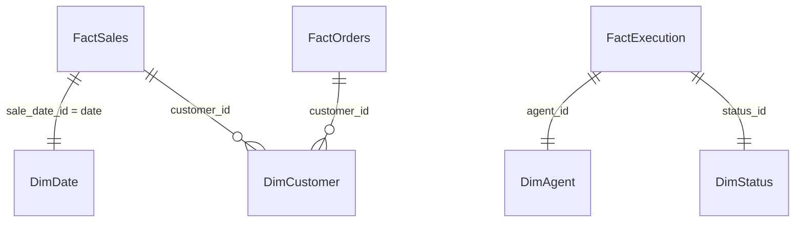

# Power BI Integration & Data Modeling Guide

This folder contains the documentation and structures required to bind the containerized MySQL production database (`agentic_ai_etl`) to Microsoft Power BI.

---

## 1. Schema Connection Configuration

Power BI connects directly to MySQL using the MySQL Database connector.

### Connection Parameters:
- **Server**: `localhost:3306` (or the IP of the database container if deployed on a remote server)
- **Database**: `agentic_ai_etl`
- **Username**: `etl_user`
- **Password**: `etl_password`

---

## 2. Power BI Data Model Architecture

To build high-performance charts, load the tables as a star/snowflake schema.



### Fact Tables
1. **FactSales**: Loaded from the `sales` table.
   - `sale_id` (PK)
   - `order_id` (FK)
   - `product_id` (FK)
   - `quantity`
   - `unit_price`
   - `total_price`
   - `sale_date`
2. **FactOrders**: Loaded from the `orders` table.
   - `order_id` (PK)
   - `customer_id` (FK)
   - `order_date`
   - `status`
   - `total_amount`
3. **FactExecution**: Loaded from the `pipeline_logs` and `agent_logs` tables.
   - `pipeline_id` (PK)
   - `start_time`
   - `end_time`
   - `execution_time`
   - `status`

### Dimension Tables
1. **DimCustomer**: Loaded from the `customers` table.
   - `customer_id` (PK)
   - `customer_name`
   - `email`
   - `phone`
   - `region`
2. **DimAgent**: Loaded from unique `agent_name` values in `agent_logs`.
   - `agent_id`
   - `agent_name`
   - `role`
3. **DimDate**: Created dynamically in Power BI using DAX.
   ```dax
   DimDate = CALENDAR(MIN(orders[order_date]), MAX(orders[order_date]))
   ```

---

## 3. Power BI Dashboard Layouts

### Page 1: Executive Dashboard
- **Total Rows Processed**: Card Visual (`COUNT(FactExecution[pipeline_id])`)
- **Success Rate**: Gauge Visual (`Successful Loads / Total Loads * 100`)
- **Active Pipelines Count**: Card Visual (`COUNTROWS(FILTER(FactExecution, status = "Running"))`)
- **Pipeline Runtimes Trend**: Line Chart (`Average execution_time` over time)

### Page 2: Data Quality Dashboard
- **Data Quality Score**: Card/Gauge Visual (`Average quality_score` from `quality_reports`)
- **Null Percentage by Column**: Bar Chart showing completeness.
- **Duplicate Records Over Time**: Area Chart mapping duplicate counts from quality reports.

### Page 3: ETL Performance Dashboard
- **Average Runtime per Agent**: Horizontal Bar Chart mapping agent execution times.
- **Data Volume vs. Loading Duration**: Scatter Plot analyzing load rates.
- **Pipeline Bottlenecks Analysis**: Matrix table sorting steps by execution duration.

### Page 4: Root Cause Dashboard
- **Error Categories Distribution**: Donut Chart category classification.
- **RCA Severity and Count**: Treemap mapping issue occurrences.
- **AI Recommendations Grid**: Scrollable table showing issues, root causes, and suggested actions.

### Page 5: Business Dashboard
- **Revenue over Time**: Area Chart (`SUM(total_price)`) grouped by Date.
- **Top Products by Revenue**: Bar Chart sorting products by sum of sales.
- **Regional Sales Distribution**: Map Visual using `DimCustomer[region]`.

### Page 6: AI Dashboard
- **Agent Action History**: Matrix showing agent names, tasks executed, and confidence scores.
- **AI Decision Confidence**: Gauge Visual showcasing agent run confidences.
- **Summary Text Panel**: Smart Narrative visual outputting executive summaries.

---

## 4. Triggering Dataset Refreshes
When the pipeline successfully completes execution, it invokes the **Power BI Refresh Node** (`pbi_refresh_node`).
In a production deployment, this node is configured to call the Power BI REST API endpoint:
```http
POST https://api.powerbi.com/v1.0/myorg/groups/{group_id}/datasets/{dataset_id}/refreshes
```
Authentication is handled via OAuth 2.0 Azure AD Client Credentials.
