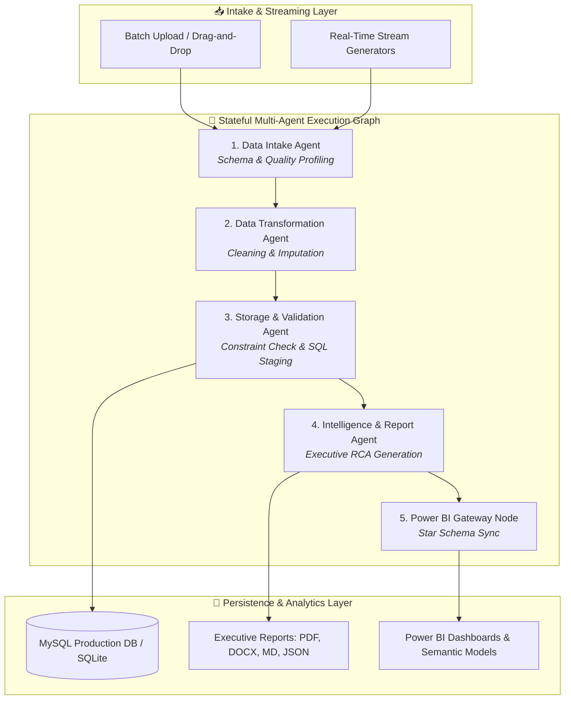

# System Architecture Documentation

This document describes the software design, agent state machine, and integration patterns implemented in the **Intelligent Autonomous Agentic AI ETL Platform**.

---

## 1. Clean Architectural Layering
The application follows **Clean Architecture** principles to isolate the core domain logic, agents, and storage boundaries:

- **Entity / State Layer (`agents_graph/state.py`)**: Defines `PipelineState` storing schemas, audit history, quality scores, circuit breaker flags, and output formats.
- **Cognitive Agent Layer (`agents/`)**: 4 specialized autonomous agents:
  1. **Data Intake Agent**: Auto-detects delimiters, infers semantic types, and assesses baseline data quality.
  2. **Data Transformation Agent**: Deduplicates, normalizes casing/dates, imputes missing values, and caps statistical outliers.
  3. **Storage & Validation Agent**: Selects target format (`SQL`, `CSV`, `Word`), provisions schemas, and stages records into MySQL/SQLite.
  4. **Intelligence & Report Agent**: Generates executive RCA reports in PDF, Microsoft Word (.docx), Markdown, and JSON.
- **Interface Adapters (`backend/api/`)**: FastAPI domain routers handling batch file ingestion, real-time synthetic stream simulation, chat with RAG, and Power BI data sync.
- **Frameworks & Storage Drivers (`backend/database/`)**: SQLAlchemy ORM with automatic fallback to SQLite WAL mode when MySQL is disconnected.

---

## 2. Multi-Agent Orchestration & Data Flow Diagram

---

## 3. Real-Time Streaming Telemetry Presets

Control AI ETL supports high-throughput continuous streaming generators alongside traditional batch uploads:
1. **Financial & Payments (`transactions`)**: Ingests transactions with customer IDs, merchant details, category tags, amounts, and settlement statuses.
2. **Industrial IoT Telemetry (`iot_sensors`)**: Ingests high-frequency sensor readings (vibration, pressure, temperature, power draw).
3. **Global E-Commerce Logistics (`ecommerce_orders`)**: Ingests SKU item orders, shipping regions, and authorization flags.

---

## 4. Microservice Containers Specification

| Container Name | Base Image / Port | Role & Responsibility |
| :--- | :--- | :--- |
| **`etl_backend`** | Python 3.11 / `:8000` | FastAPI application, LangGraph state machine, REST APIs |
| **`etl_mysql`** | MySQL 8.0 / `:3306` | Production relational database (`agentic_ai_etl`) & staging schema |
| **`etl_redis`** | Redis 7 / `:6379` | In-memory cache, rate limiting, and distributed batch locks |
| **`etl_snaplogic`**| SnapLogic IIP / `:8080`| Commercial integration platform visual data flow simulator |
| **`etl_ollama`** | Ollama / `:11434` | Air-gapped offline local LLM runner |
